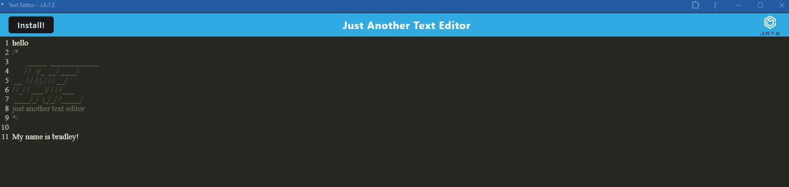

# PWA Text Editor

## Project Title
PWA Text Editor 

## Description
This is a PAW that allows a users to create a note or lines of code with or without being connected to the wifi. The app uses different techniques that make it function offline by using cache methods. Users can install the app directly onto their device and use it offline. This is bridging the gap between online and offline usage.

## Table of Contents
* [Install](#installation)
* [Usage](#usage)
* [License](#license)
* [Links](#links)
* [Contribution](#contributions)
* [Tests](#tests)
* [Questions](#questions)

## Installation
First start by running npm install, npm run build, and then npm start. After you do this, open your browser to localhost:3000

## Usage
Once the app is running the user can use it to write and save notes while offline. They can close and reopen the browser and the content will still be there and available for use. This is extremely useful, especially in an area with little or no internet connection. The install button allows for easy installation directly to the users devicwe.

Features

* Progressive Web Application (PWA)
* IndexedDB to store content even when offline.
* Service Worker
* Webpack

Tech Used
* JavaScript, Node.js, Express.js, IndexedDB, Webpack, Babel, Workbox, Render

## License
The following license was used: .

## Links
[GitHub Repo](https://github.com/bragonese1/pwa-text-editor) |
[Deployed App](https://pwa-text-editor-1-u0h0.onrender.com/)

## Contributions
Contributions, issues, and feature requests are welcome! Submit a pull request.

## Tests
N/A

## Questions
- Contact Me for Questions:
[GitHub](https://github.com/bragonese1) | [Email](mailto:ragonesebradley@gmail.com)

